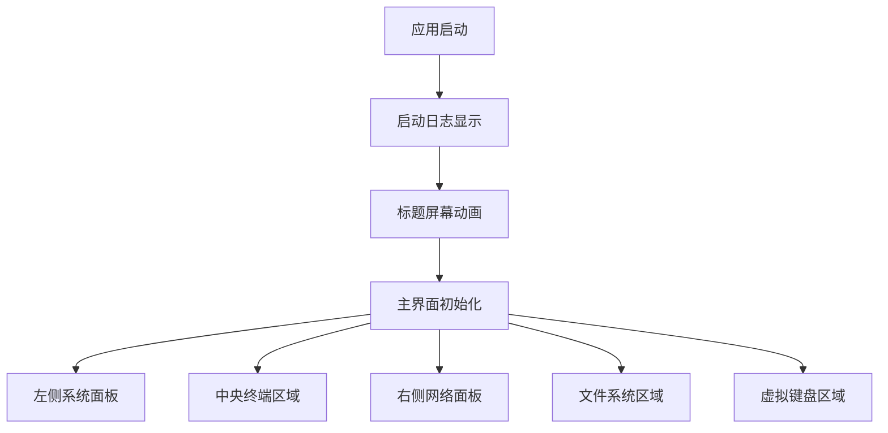

# XDo-UI React重构版本同步需求文档

## 1. 产品概述

XDo-UI是一个基于Electron的终端界面应用程序，具有科幻风格的用户界面和丰富的系统监控功能。React重构版本需要完全复现原版的视觉效果、交互体验和功能特性，同时确保与最新Node.js和Electron版本的兼容性。

本项目旨在解决React重构版本与原版在布局、UI设计、功能实现等方面的差异，通过系统性的同步方案实现完全一致的用户体验。

目标是创建一个现代化、可维护的React版本，同时保持原版的所有特色功能和视觉效果。

## 2. 核心功能

### 2.1 用户角色

| 角色 | 注册方式 | 核心权限 |
|------|----------|----------|
| 终端用户 | 直接启动应用 | 可使用所有终端功能、系统监控、文件管理等 |

### 2.2 功能模块

我们的XDo-UI React重构版本包含以下主要页面：

1. **启动界面**：启动日志显示、标题屏幕动画、主题加载
2. **主界面**：三栏布局设计，包含系统面板、终端区域、网络面板
3. **文件系统界面**：文件浏览、预览、管理功能
4. **虚拟键盘界面**：可定制的虚拟键盘布局
5. **设置界面**：主题配置、用户偏好设置

### 2.3 页面详情

| 页面名称 | 模块名称 | 功能描述 |
|----------|----------|----------|
| 启动界面 | 启动日志 | 显示系统启动信息，模拟终端启动过程 |
| 启动界面 | 标题动画 | 显示XDo-UI标题，包含发光效果和边框动画 |
| 启动界面 | 音频管理 | 播放启动音效，管理界面音频反馈 |
| 主界面 | 左侧系统面板 | 显示时钟、系统信息、硬件监控、CPU信息、内存监控、进程列表 |
| 主界面 | 中央终端区域 | 主终端界面，支持多标签页，显示欢迎信息 |
| 主界面 | 右侧网络面板 | 显示网络状态、地理位置、连接信息 |
| 文件系统界面 | 文件浏览器 | 浏览文件目录，支持列表和图标视图 |
| 文件系统界面 | 文件预览 | 预览文件内容，支持多种文件类型 |
| 虚拟键盘界面 | 键盘布局 | 显示可交互的虚拟键盘 |
| 虚拟键盘界面 | 键盘配置 | 支持不同键盘布局的切换 |

## 3. 核心流程

### 主要用户操作流程

1. **应用启动流程**：用户启动应用 → 显示启动日志 → 播放启动音效 → 显示标题动画 → 初始化主界面
2. **界面初始化流程**：加载主题 → 创建三栏布局 → 逐步显示各个模块 → 播放展开动画
3. **模块交互流程**：用户点击模块 → 播放音效反馈 → 显示模块内容 → 更新状态信息

## 4. 用户界面设计

### 4.1 设计风格

- **主色调**：绿色主题 (#00ff00)，可通过CSS变量自定义
- **次要颜色**：深黑色背景 (#000000)，半透明覆盖层
- **按钮样式**：带边框的矩形按钮，支持发光效果
- **字体**：等宽字体 (Courier New, monospace)，支持自定义字体加载
- **布局风格**：三栏网格布局，科幻风格边框和动画效果
- **图标样式**：简约线条图标，与终端风格保持一致

### 4.2 页面设计概览

| 页面名称 | 模块名称 | UI元素 |
|----------|----------|--------|
| 启动界面 | 启动日志 | 黑色背景，绿色文字，逐行显示启动信息 |
| 启动界面 | 标题动画 | 居中标题，边框动画，发光效果，渐变背景 |
| 主界面 | 系统面板 | 17%宽度，固定定位，模块化卡片布局 |
| 主界面 | 终端区域 | 65%宽度，augmented-ui边框，多标签页支持 |
| 主界面 | 网络面板 | 17%宽度，右侧定位，网络状态显示 |
| 文件系统界面 | 文件浏览 | 底部区域，可切换列表/图标视图 |
| 虚拟键盘界面 | 键盘布局 | 底部固定，可折叠，按键动画效果 |

### 4.3 响应式设计

产品主要面向桌面端使用，采用固定布局设计，针对不同屏幕尺寸提供额外的比例适配CSS文件。支持全屏模式和窗口模式的无缝切换。