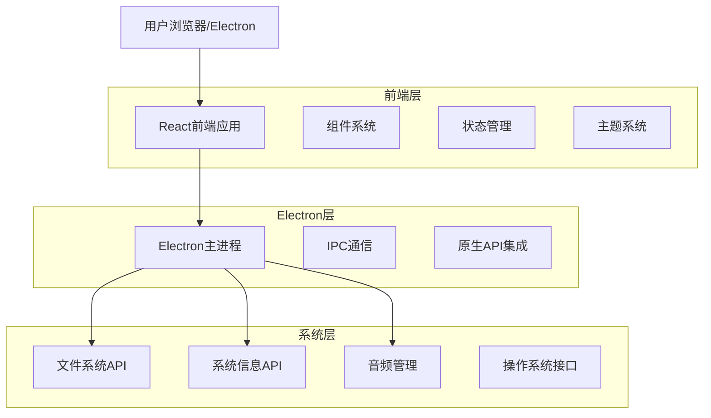
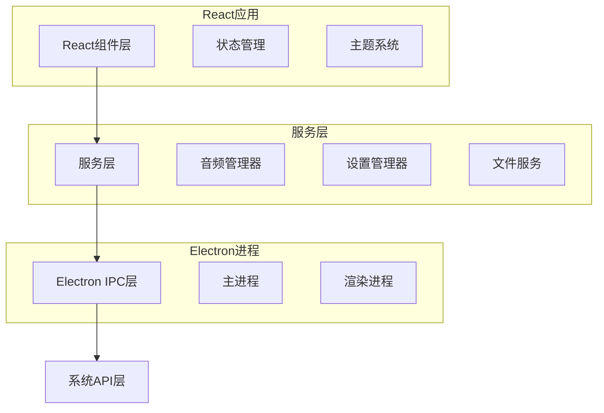
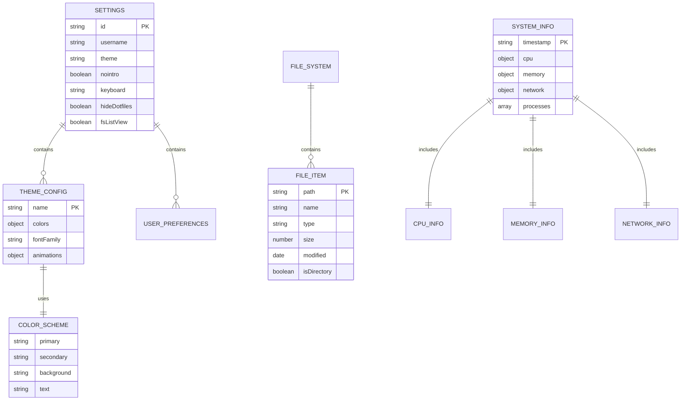

# XDo-UI React重构版本技术架构文档

## 1. 架构设计



## 2. 技术描述

- 前端：React@18 + TypeScript + Vite + TailwindCSS
- 桌面框架：Electron (最新稳定版)
- 状态管理：Zustand
- 样式系统：CSS Modules + CSS变量
- 构建工具：Vite
- 开发工具：ESLint + Prettier + Vitest

## 3. 路由定义

| 路由 | 用途 |
|------|------|
| / | 主界面，显示三栏布局和所有核心功能 |
| /boot | 启动界面，显示启动日志和标题动画 |
| /settings | 设置页面，配置主题和用户偏好 |

## 4. API定义

### 4.1 核心API

#### 系统信息相关
```
GET /api/system/info
```

响应：
| 参数名称 | 参数类型 | 描述 |
|----------|----------|------|
| cpu | object | CPU信息，包含型号、核心数、使用率 |
| memory | object | 内存信息，包含总量、已用、可用 |
| disk | array | 磁盘信息数组 |
| network | object | 网络接口信息 |

示例：
```json
{
  "cpu": {
    "model": "Intel Core i7",
    "cores": 8,
    "usage": 45.2
  },
  "memory": {
    "total": 16777216,
    "used": 8388608,
    "free": 8388608
  }
}
```

#### 文件系统相关
```
GET /api/filesystem/list
```

请求：
| 参数名称 | 参数类型 | 是否必需 | 描述 |
|----------|----------|----------|------|
| path | string | true | 要列出的目录路径 |
| showHidden | boolean | false | 是否显示隐藏文件 |

响应：
| 参数名称 | 参数类型 | 描述 |
|----------|----------|------|
| files | array | 文件列表 |
| directories | array | 目录列表 |

#### 主题系统相关
```
POST /api/theme/apply
```

请求：
| 参数名称 | 参数类型 | 是否必需 | 描述 |
|----------|----------|----------|------|
| themeName | string | true | 主题名称 |
| customColors | object | false | 自定义颜色配置 |

## 5. 服务器架构图



## 6. 数据模型

### 6.1 数据模型定义



### 6.2 数据定义语言

#### 设置配置 (Settings)
```typescript
// 设置接口定义
interface Settings {
  username?: string;
  theme: string;
  nointro: boolean;
  nointroOverride?: boolean;
  keyboard: string;
  hideDotfiles: boolean;
  fsListView: boolean;
  audioEnabled: boolean;
  customThemeColors?: {
    r: number;
    g: number;
    b: number;
  };
}

// 主题配置接口
interface ThemeConfig {
  name: string;
  colors: {
    primary: string;
    secondary: string;
    background: string;
    text: string;
    accent: string;
  };
  fontFamily: string;
  animations: {
    duration: number;
    easing: string;
  };
}

// 文件系统项目接口
interface FileSystemItem {
  path: string;
  name: string;
  type: 'file' | 'directory';
  size: number;
  modified: Date;
  isHidden: boolean;
  permissions: {
    read: boolean;
    write: boolean;
    execute: boolean;
  };
}

// 系统信息接口
interface SystemInfo {
  cpu: {
    model: string;
    cores: number;
    usage: number;
    temperature?: number;
  };
  memory: {
    total: number;
    used: number;
    free: number;
    cached: number;
  };
  network: {
    interfaces: NetworkInterface[];
    activeConnections: number;
    bytesReceived: number;
    bytesSent: number;
  };
  processes: ProcessInfo[];
}

// 网络接口信息
interface NetworkInterface {
  name: string;
  type: string;
  ip4: string;
  ip6?: string;
  mac: string;
  speed: number;
  isActive: boolean;
}

// 进程信息
interface ProcessInfo {
  pid: number;
  name: string;
  cpu: number;
  memory: number;
  user: string;
}
```

#### 初始化数据
```typescript
// 默认设置
const defaultSettings: Settings = {
  theme: 'tron',
  nointro: false,
  keyboard: 'en-US',
  hideDotfiles: true,
  fsListView: false,
  audioEnabled: true
};

// 默认主题配置
const defaultTheme: ThemeConfig = {
  name: 'tron',
  colors: {
    primary: '#00ff00',
    secondary: '#00aa00',
    background: '#000000',
    text: '#00ff00',
    accent: '#ffffff'
  },
  fontFamily: 'Courier New, monospace',
  animations: {
    duration: 500,
    easing: 'cubic-bezier(0.4, 0, 1, 1)'
  }
};
```