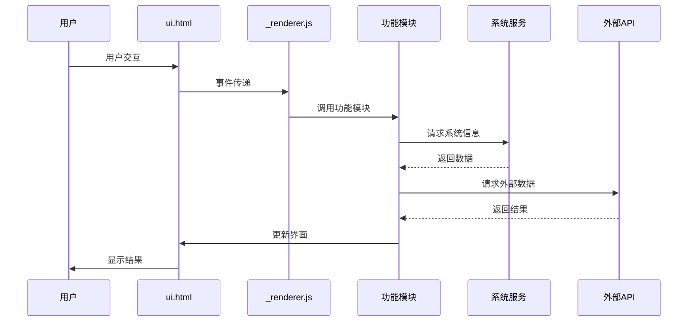
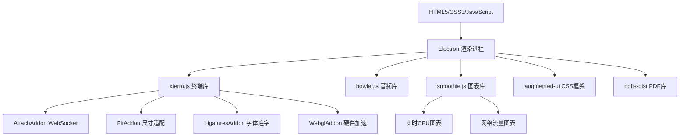
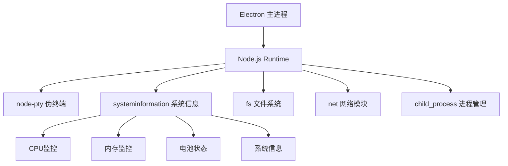
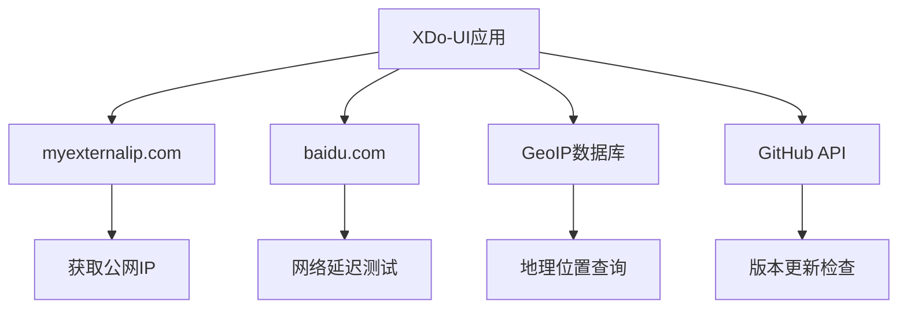

# XDo-UI 项目详细文档

## 项目概述

XDo-UI 是一个全屏、跨平台的终端模拟器和系统监视器，继承自 eDEX-UI 项目。它提供了一个科幻风格的桌面环境，集成了终端模拟器、实时系统监控、网络状态显示等多种功能。

### 基本信息

- **项目名称**: XDo-UI
- **版本**: 2.2.9
- **描述**: "A science fiction desktop running everywhere. Awesome."
- **许可证**: GPLv3.0
- **技术栈**: Electron + Node.js + HTML/CSS/JavaScript

## 项目架构

### 技术架构图

```mermaid
graph TD
    A[用户界面 ui.html] --> B[渲染进程 _renderer.js]
    B --> C[主进程 _boot.js]
    B --> D[功能类模块]

    subgraph "核心功能模块"
        D --> E[Terminal 终端模拟器]
        D --> F[FilesystemDisplay 文件系统]
        D --> G[Keyboard 虚拟键盘]
        D --> H[Modal 模态窗口]
    end

    subgraph "监控模块"
        D --> I[Sysinfo 系统信息]
        D --> J[Cpuinfo CPU监控]
        D --> K[RAMwatcher 内存监控]
        D --> L[Netstat 网络状态]
        D --> M[Conninfo 网络流量]
    end

    subgraph "扩展功能"
        D --> N[LocationGlobe 地球仪]
        D --> O[TopList 进程列表]
        D --> P[MediaPlayer 媒体播放器]
        D --> Q[DocReader 文档阅读器]
    end

    subgraph "系统服务"
        E --> R[node-pty 伪终端]
        I --> S[systeminformation 系统信息]
        H --> T[howler.js 音频]
        J --> U[smoothie.js 图表]
    end

    subgraph "外部服务"
        L --> V[myexternalip.com]
        L --> W[baidu.com]
        N --> X[GeoIP数据库]
    end
end
```

### 目录结构

```
XDo-UI/
├── src/                          # 源代码目录
│   ├── _boot.js                  # Electron主进程入口
│   ├── _renderer.js              # 渲染进程入口
│   ├── ui.html                   # 主界面HTML
│   ├── package.json              # 前端依赖配置
│   ├── classes/                  # 功能类目录
│   │   ├── terminal.class.js     # 终端模拟器类
│   │   ├── filesystem.class.js   # 文件系统显示类
│   │   ├── keyboard.class.js     # 虚拟键盘类
│   │   ├── modal.class.js        # 模态窗口类
│   │   ├── sysinfo.class.js      # 系统信息类
│   │   ├── cpuinfo.class.js      # CPU监控类
│   │   ├── ramwatcher.class.js   # 内存监控类
│   │   ├── netstat.class.js      # 网络状态类
│   │   ├── conninfo.class.js     # 网络流量类
│   │   ├── locationGlobe.class.js # 地球仪类
│   │   ├── toplist.class.js      # 进程列表类
│   │   ├── clock.class.js        # 时钟类
│   │   ├── audiofx.class.js      # 音效管理类
│   │   ├── fuzzyFinder.class.js  # 模糊搜索类
│   │   ├── docReader.class.js    # 文档阅读器类
│   │   ├── mediaPlayer.class.js  # 媒体播放器类
│   │   ├── hardwareInspector.class.js # 硬件检查器类
│   │   └── updateChecker.class.js # 更新检查器类
│   └── assets/                   # 资源文件目录
│       ├── audio/                # 音效文件
│       ├── css/                  # 样式文件
│       ├── fonts/                # 字体文件
│       ├── icons/                # 图标文件
│       ├── kb_layouts/           # 键盘布局
│       ├── misc/                 # 杂项文件
│       ├── themes/               # 主题配置
│       └── vendor/               # 第三方库
├── package.json                  # 项目配置
├── prebuild-minify.js           # 构建压缩脚本
├── file-icons-generator.js      # 图标生成脚本
└── README.md                     # 项目说明
```

### 核心架构组件

#### 1. 主进程 (\_boot.js)

**核心职责**:

- **应用启动管理**: 处理 Electron 应用的启动流程，包括单实例检查和窗口初始化
- **窗口创建**: 创建和管理主窗口，支持全屏模式和窗口状态恢复
- **异常处理**: 全局异常捕获和处理，确保应用稳定性
- **单实例锁定**: 使用`app.requestSingleInstanceLock()`确保只运行一个应用实例
- **环境配置**: 设置环境变量和 GPU 加速，优化渲染性能
- **配置文件管理**: 初始化用户配置文件到用户数据目录
  - `settings.json`: 用户设置（主题、音效、时钟格式等）
  - `shortcuts.json`: 快捷键配置
  - `lastWindowState.json`: 窗口状态（位置、大小、显示状态）
- **资源镜像**: 复制主题、键盘布局和字体文件到用户目录

**技术实现细节**:

- 使用`electron`框架的主进程 API
- 实现窗口状态持久化机制
- 集成文件系统操作进行资源管理
- 支持开发模式和生产模式的不同配置

#### 2. 渲染进程 (\_renderer.js)

**核心职责**:

- **安全配置**: 禁用`eval()`函数，增强应用安全性
- **辅助函数**: 提供 HTML 转义、URI 编码、CSS 净化等安全工具函数
- **错误处理**: 初始化全局错误处理机制，捕获未处理的异常
- **配置加载**: 异步加载用户配置和设置文件
- **主题系统**: 动态加载和应用 UI 主题，支持 CSS 变量注入
- **多线程支持**: 通过代理模式实现`systeminformation`模块的多线程调用
- **模块初始化**: 协调各个功能模块的初始化顺序

**技术实现细节**:

- 使用`@electron/remote`进行主进程通信
- 实现安全的 HTML 内容处理机制
- 支持主题的热切换功能
- 集成音效系统的全局控制
- 提供统一的错误报告机制

#### 3. 用户界面 (ui.html)

**核心职责**:

- **HTML 结构**: 定义应用程序的基本 DOM 结构和布局容器
- **样式引入**: 按模块化方式加载 CSS 文件，支持主题覆盖
- **依赖库**: 引入第三方 JavaScript 库（xterm.js、howler.js、smoothie.js 等）
- **模块加载**: 按依赖顺序加载各个功能类文件
- **启动屏幕**: 提供应用启动时的加载界面

**技术实现细节**:

- 使用`augmented-ui`库实现科幻风格的 UI 元素
- 模块化 CSS 架构，支持组件级样式隔离
- 异步加载机制，优化首屏渲染性能
- 响应式设计，适配不同屏幕尺寸

### 数据流架构



### 模块间通信机制

1. **事件驱动架构**: 各模块通过自定义事件进行通信
2. **IPC 通信**: 渲染进程与主进程通过`ipcRenderer`通信
3. **WebSocket 连接**: 终端模拟器通过 WebSocket 与后端服务通信
4. **定时器协调**: 统一管理各模块的定时更新任务
5. **状态共享**: 通过全局对象共享应用状态

## 核心功能模块

### 1. 终端模拟器 (terminal.class.js)

**功能特性**:

- 基于 xterm.js 库的完整终端模拟，支持 VT100/VT220 终端协议
- 支持终端尺寸动态调整，自动适配窗口大小变化
- 自定义颜色滤镜支持，通过`window.theme.terminal.colorFilter`配置
- WebSocket 连接后端服务，实现实时数据传输
- 音频反馈集成，终端操作时播放音效
- 进程间通信(IPC)支持，监听当前工作目录变化

**技术实现细节**:

- **核心库**: 使用`xterm.js`进行终端渲染，集成多个插件：
  - `AttachAddon`: WebSocket 连接管理
  - `FitAddon`: 终端尺寸自适应
  - `LigaturesAddon`: 字体连字支持
  - `WebglAddon`: WebGL 硬件加速渲染
- **颜色处理**: 实现`colorify`函数，支持主题颜色动态转换
- **IPC 通信**: 通过`ipcRenderer`监听`cwd`和`process`事件
- **WebSocket**: 建立与后端的双向通信，支持数据流传输
- **配置管理**: 支持字体、光标样式、主题颜色等终端属性配置
- **事件处理**: 自定义按键事件处理，支持特殊键序列

**代码架构**:

```javascript
class Terminal {
  constructor(container) {
    this.term = new Terminal(config); // xterm.js实例
    this.fitAddon = new FitAddon(); // 尺寸适配插件
    this.attachAddon = new AttachAddon(socket); // WebSocket插件
    this._setupPlugins(); // 插件初始化
    this._setupEventHandlers(); // 事件处理器
  }

  _sendSizeToServer() {
    /* 尺寸同步 */
  }
  colorify(color) {
    /* 颜色转换 */
  }
  doCustomFilter(theme) {
    /* 主题滤镜 */
  }
}
```

### 2. 文件系统显示器 (filesystem.class.js)

**功能特性**:

- 文件系统浏览和导航，支持目录树结构显示
- 文件大小格式化显示，使用`_formatBytes`函数美化显示
- 文件类型图标匹配，基于文件扩展名动态加载图标
- 隐藏文件显示切换，通过`toggleHidedotfiles`控制
- 列表视图支持，`toggleListview`切换显示模式
- 当前工作目录跟踪，`followTab`函数同步终端 CWD

**技术实现细节**:

- **文件系统 API**: 通过`_asyncFSwrapper`代理`fs`模块，将回调转换为 Promise
- **实时监控**: 使用`watchFS`函数监听目录变化，自动刷新显示
- **图标系统**: 集成文件图标库，支持自定义图标覆盖
- **磁盘使用**: `readFS`函数计算目录大小和磁盘使用情况
- **错误处理**: `setFailedState`处理文件系统访问失败的情况
- **性能优化**: 异步读取文件信息，避免 UI 阻塞

**代码架构**:

```javascript
class FilesystemDisplay {
  constructor(container) {
    this.cwd = process.cwd(); // 当前工作目录
    this.icons = {}; // 图标缓存
    this.customIcons = {}; // 自定义图标
    this._loadIcons(); // 加载图标库
  }

  async readFS(path) {
    /* 异步读取目录 */
  }
  followTab(term) {
    /* 跟踪终端CWD */
  }
  watchFS() {
    /* 监听文件系统变化 */
  }
  _formatBytes(bytes) {
    /* 格式化文件大小 */
  }
}
```

### 3. 系统信息显示 (sysinfo.class.js)

**功能特性**:

- 操作系统信息显示，根据平台（macOS、Windows、Linux）显示不同信息
- 实时系统运行时间，格式化为"天 d 小时:分钟"显示
- 电池状态监控，显示电量百分比和充电状态
- 电源连接状态检测，区分充电中、已连接电源等状态

**技术实现细节**:

- **平台检测**: 根据`process.platform`创建不同的 DOM 结构
- **定时更新**:
  - `updateDate`: 每天更新日期显示
  - `updateUptime`: 每分钟更新系统运行时间
  - `updateBattery`: 每 3 秒更新电池状态
- **系统 API**: 通过`window.si.battery()`获取电池信息
- **时间计算**: 实现运行时间的天、小时、分钟格式化

**代码架构**:

```javascript
class Sysinfo {
  constructor(container) {
    this.container = container;
    this._createPlatformSpecificUI(); // 创建平台特定UI
    this._startUpdateTimers(); // 启动定时器
  }

  updateDate() {
    /* 更新日期 */
  }
  updateUptime() {
    /* 更新运行时间 */
  }
  updateBattery() {
    /* 更新电池状态 */
  }
}
```

### 4. 网络状态监控 (netstat.class.js)

**功能特性**:

- 公网 IP 获取和显示，通过外部 API 实时获取
- 在线/离线状态检测，基于网络连接状态判断
- 网络延迟测量(ping)，支持自定义目标和端口
- 网络接口信息显示，显示配置的网络接口名称
- GeoIP 地理位置查询（可选功能，默认禁用）
- TCP socket 连接测试，实现自定义 ping 功能

**技术实现细节**:

- **外部 API**: 通过`https://myexternalip.com/raw`获取公网 IP
- **延迟测试**: 对`baidu.com:80`进行 TCP 连接测试
- **Socket 编程**: 使用 Node.js 的`net`模块创建 TCP 连接
- **定时更新**: `updateInfo`函数定期更新网络状态
- **错误处理**: 网络请求失败时的降级处理
- **配置支持**: 支持自定义网络接口名称显示

**代码架构**:

```javascript
class Netstat {
  constructor(container) {
    this.container = container;
    this.isOffline = false;
    this.lastConnectedTime = null;
    this.geoipDisabled = true; // 默认禁用GeoIP
    this._startUpdateTimer(); // 启动更新定时器
  }

  async updateInfo() {
    /* 更新网络信息 */
  }
  ping(host, port, timeout) {
    /* TCP ping实现 */
  }
}
```

### 5. CPU 信息监控 (cpuinfo.class.js)

**功能特性**:

- CPU 使用率实时图表，支持多核心分别显示
- CPU 名称和核心数显示，自动检测 CPU 规格
- CPU 温度监控（非 Windows 平台），实时温度显示
- CPU 频率信息，显示当前运行频率
- 运行进程数统计，显示系统任务数量

**技术实现细节**:

- **图表渲染**: 使用`smoothie.js`创建实时 CPU 使用率图表
- **多核支持**: 根据 CPU 核心数量动态创建图表，支持分屏显示
- **数据采集**: 通过`window.si`代理调用`systeminformation`模块
- **定时更新**:
  - `updateCPUload`: 更新 CPU 负载图表
  - `updateCPUtemp`: 更新 CPU 温度（非 Windows）
  - `updateCPUspeed`: 更新 CPU 频率
  - `updateCPUtasks`: 更新系统任务数
- **平台兼容**: Windows 平台禁用温度监控功能

**代码架构**:

```javascript
class Cpuinfo {
  constructor(container) {
    this.charts = []; // CPU图表数组
    this.timelines = []; // 时间线数组
    this._createCharts(); // 创建多核心图表
    this._startUpdateTimers(); // 启动更新定时器
  }

  updateCPUload() {
    /* 更新CPU负载 */
  }
  updateCPUtemp() {
    /* 更新CPU温度 */
  }
  updateCPUspeed() {
    /* 更新CPU频率 */
  }
  updateCPUtasks() {
    /* 更新任务数 */
  }
}
```

### 6. 内存监控 (ramwatcher.class.js)

**功能特性**:

- 内存使用可视化（440 点网格），直观显示内存状态
- 内存状态分类显示（活跃/可用/空闲），不同颜色区分
- 总内存和已用内存显示，格式化为 GiB 单位
- 交换空间监控，显示 swap 使用情况
- 进度条和数值显示，双重可视化方式

**技术实现细节**:

- **网格可视化**: 创建 440 个点的网格，每个点代表内存状态
- **状态映射**: 根据内存使用比例分配点的颜色状态
  - `active`: 活跃内存（红色）
  - `available`: 可用内存（黄色）
  - `free`: 空闲内存（绿色）
- **随机化**: 使用`shuffleArray`函数随机打乱点的显示顺序
- **数据更新**: 每 1.5 秒通过`window.si.mem()`获取内存数据
- **格式化显示**: 内存大小转换为 GiB 单位，保留小数点

**代码架构**:

```javascript
class RAMwatcher {
  constructor(container) {
    this.points = []; // 440个内存点
    this._createGrid(); // 创建网格
    this._shufflePoints(); // 随机化点顺序
    this._startUpdateTimer(); // 启动更新定时器
  }

  updateInfo() {
    /* 更新内存信息 */
  }
  shuffleArray(array) {
    /* 数组随机化 */
  }
}
```

### 7. 虚拟键盘 (keyboard.class.js)

**功能特性**:

- 多语言键盘布局支持，从 JSON 文件动态加载布局
- 修饰键状态管理（Shift、CapsLock、Alt、Ctrl、Fn），支持组合键
- 控制序列处理，支持特殊控制字符和转义序列
- 快捷键支持，内置常用快捷键组合（如 Ctrl+C、Ctrl+V 等）
- 长按重复输入，模拟物理键盘的按键重复
- SVG 图标支持，显示箭头等特殊符号

**技术实现细节**:

- **布局解析**: 从 JSON 文件解析键盘布局，支持多行键盘结构
- **DOM 生成**: 动态创建键盘按键 DOM 元素，支持不同尺寸的按键
- **状态管理**: 维护修饰键状态（`isShiftOn`、`isCapsLckOn`等）
- **事件处理**:
  - `mousedown`/`mouseup`事件处理按键按下和释放
  - 长按检测和重复输入机制
  - 特殊按键（回车、空格）的动画效果
- **终端集成**: 通过`linkedToTerm`属性与终端模拟器连接
- **音效反馈**: 按键操作时播放音效

**代码架构**:

```javascript
class Keyboard {
  constructor(container, layout) {
    this.layout = layout; // 键盘布局
    this.linkedToTerm = null; // 关联的终端
    this.modifierStates = {}; // 修饰键状态
    this.ctrlseq = {}; // 控制序列映射
    this._loadLayout(); // 加载布局
    this._createKeyboard(); // 创建键盘DOM
  }

  attach(terminal) {
    /* 连接终端 */
  }
  detach() {
    /* 断开连接 */
  }
  _handleKeyPress(key) {
    /* 处理按键 */
  }
}
```

### 8. 模态窗口系统 (modal.class.js)

**功能特性**:

- 多种模态框类型（error、warning、custom、info），支持不同样式
- 拖拽功能支持，可拖动模态框位置
- 焦点管理，自动聚焦到模态框
- 唯一 ID 生成，避免 ID 冲突
- 音效反馈，打开/关闭时播放音效
- 层级管理，支持多个模态框叠加

**技术实现细节**:

- **ID 生成**: 使用`nanoid`库生成唯一标识符
- **拖拽实现**:
  - 监听`mousedown`、`mousemove`、`mouseup`事件
  - 支持触摸设备的拖拽操作
  - 边界检测，防止拖拽超出屏幕
- **类型系统**: 根据类型应用不同的 CSS 类和图标
- **焦点管理**: 自动聚焦到第一个可聚焦元素
- **事件处理**: ESC 键关闭、点击外部关闭等交互
- **动画效果**: CSS 过渡动画，平滑的显示/隐藏效果

**代码架构**:

```javascript
class Modal {
  constructor(options) {
    this.id = nanoid(); // 唯一ID
    this.type = options.type; // 模态框类型
    this.draggable = options.draggable; // 是否可拖拽
    this._createElement(); // 创建DOM元素
    this._setupEventHandlers(); // 设置事件处理
  }

  show() {
    /* 显示模态框 */
  }
  hide() {
    /* 隐藏模态框 */
  }
  _enableDragging() {
    /* 启用拖拽 */
  }
}
```

### 9. 音频管理 (audiofx.class.js)

**功能特性**:

- 多种音效支持
- 音量控制
- 条件音效播放
- 错误处理

**技术实现**:

- 基于`howler.js`库
- 代理模式避免错误
- 用户设置集成

### 10. 地理位置地球仪 (locationGlobe.class.js)

**功能特性**:

- 3D 地球仪显示
- 地理位置标记
- 网络连接可视化
- 卫星轨道显示
- 实时位置更新

**技术实现**:

- 使用`encom-globe.js`库
- WebGL 渲染
- 地理数据集成
- 动画效果

### 11. 进程列表 (toplist.class.js)

**功能特性**:

- 实时进程监控
- 进程信息显示(PID、名称、CPU、内存)
- 进程排序
- 详细进程列表
- 进程状态监控

**技术实现**:

- PowerShell 命令集成
- JSON 数据解析
- 实时更新机制

### 12. 模糊搜索 (fuzzyFinder.class.js)

**功能特性**:

- 当前目录文件搜索
- 模糊匹配算法
- 键盘导航
- 快速文件选择

**技术实现**:

- 文件名模糊匹配
- 键盘事件处理
- 结果排序优化

### 13. 时钟显示 (clock.class.js)

**功能特性**:

- 12/24 小时制支持
- 实时时间更新
- 自定义显示格式

### 14. 网络流量监控 (conninfo.class.js)

**功能特性**:

- 网络上传/下载速度图表
- 总流量统计
- 实时数据可视化
- 模拟数据生成

**技术实现**:

- 使用`smoothie.js`绘制图表
- 高频数据更新
- 美化的数据显示

### 15. 文档阅读器 (docReader.class.js)

**功能特性**:

- PDF 文档查看
- 页面导航
- 缩放功能
- 页面渲染

**技术实现**:

- 基于`pdfjs-dist`库
- Canvas 渲染
- 异步加载

### 16. 媒体播放器 (mediaPlayer.class.js)

**功能特性**:

- 音频/视频播放
- 播放控制
- 音量调节
- 全屏支持
- 进度控制

**技术实现**:

- HTML5 媒体 API
- 自定义控制界面
- 全屏 API 集成

### 17. 硬件检查器 (hardwareInspector.class.js)

**功能特性**:

- 硬件制造商信息
- 设备型号显示
- 机箱类型检测

### 18. 更新检查器 (updateChecker.class.js)

**功能特性**:

- GitHub 版本检查
- 自动更新提醒
- 版本比较
- 错误处理

**技术实现**:

- GitHub API 集成
- HTTPS 请求
- 版本号解析

## 主题系统

### 主题配置结构

每个主题包含以下配置:

```json
{
  "colors": {
    "r": 0,
    "g": 120,
    "b": 215,
    "black": "#000000",
    "light_black": "#0d1117",
    "grey": "#262626"
  },
  "cssvars": {
    "font_main": "United Sans Medium",
    "font_main_light": "United Sans Light"
  },
  "terminal": {
    "fontFamily": "Fira Mono",
    "cursorStyle": "underline",
    "foreground": "#0078d7",
    "background": "#0d1117",
    "cursor": "#0078d7",
    "cursorAccent": "#0078d7",
    "selection": "rgba(0,120,215,0.3)"
  },
  "globe": {
    "base": "#0078d7",
    "marker": "#0078d7",
    "pin": "#0078d7",
    "satellite": "#0078d7"
  }
}
```

### 可用主题

- **tron**: 经典蓝色科幻主题
- **blade**: 橙色主题
- 其他自定义主题

## 键盘布局系统

### 布局配置

键盘布局通过 JSON 文件定义，支持:

- 多行键盘布局
- 修饰键组合
- 控制序列
- 功能键映射
- 国际化支持

### 支持的布局

- en-US: 美式英语布局
- 其他语言布局可扩展

## 音效系统

### 音效文件

- `stdout.wav`: 输出音效
- `stdin.wav`: 输入音效
- `keyboard.wav`: 键盘音效
- `error.wav`: 错误音效
- `alarm.wav`: 警告音效
- `info.wav`: 信息音效
- `scan.wav`: 扫描音效
- `granted.wav`: 确认音效
- `denied.wav`: 拒绝音效

### 音效控制

- 全局音量控制
- 分类音效开关
- 反馈音效禁用选项

## 构建系统

### 构建脚本

#### prebuild-minify.js

**功能**:

- JavaScript 代码压缩(使用 Terser)
- CSS 代码压缩(使用 CleanCSS)
- JSON 文件压缩
- 递归文件处理
- 错误处理和日志

**排除文件**:

- `grid.json`: 预压缩的大文件
- 主题和键盘文件: 保持可读性
- `file-icons-match.js`: 特殊处理

#### file-icons-generator.js

**功能**:

- 从多个图标库生成统一的图标文件
- 生成文件图标匹配脚本
- SVG 图标处理
- 自定义图标覆盖

**图标来源**:

- FontAwesome 品牌图标
- file-icons/source
- devopicons
- mfixx 图标
- bytesize-icons
- 自定义 XDo-UI 图标

### 包管理

#### 根目录 package.json

**脚本命令**:

- `start`: 启动应用
- `install-linux`: Linux 安装
- `build-linux`: Linux 构建
- `build-win`: Windows 构建
- `build-mac`: macOS 构建
- `build-all`: 全平台构建

#### src/package.json

**核心依赖**:

- `@electron/remote`: Electron 远程模块，用于渲染进程访问主进程 API
- `node-pty`: 伪终端支持，提供终端模拟的底层实现
- `xterm`: 终端模拟器前端库，包含多个插件
- `systeminformation`: 系统信息获取库，跨平台系统监控
- `howler`: 音频库，处理音效播放和管理
- `smoothie`: 实时图表库，用于 CPU 和网络监控图表
- `ffi-napi`: 原生函数接口，调用系统级 API
- `pdfjs-dist`: PDF 处理库，用于文档阅读器功能

## 依赖关系分析

### 技术栈详细分析

#### 前端技术栈



#### 后端技术栈



#### 外部服务依赖



### 关键依赖版本兼容性

| 依赖包            | 当前版本   | 用途     | 兼容性说明              |
| ----------------- | ---------- | -------- | ----------------------- |
| electron          | 最新稳定版 | 应用框架 | 需要与 Node.js 版本匹配 |
| xterm             | ^4.x       | 终端模拟 | 需要配套插件版本一致    |
| node-pty          | ^0.10.x    | 伪终端   | 需要原生编译支持        |
| systeminformation | ^5.x       | 系统信息 | 跨平台兼容性良好        |
| howler            | ^2.x       | 音频处理 | Web Audio API 依赖      |
| smoothie          | ^1.x       | 实时图表 | Canvas API 依赖         |
| ffi-napi          | ^4.x       | 原生接口 | 需要原生编译环境        |

### 安全依赖分析

#### 潜在安全风险

1. **ffi-napi**: 直接调用系统 API，需要严格的输入验证
2. **@electron/remote**: 远程模块访问，需要限制权限范围
3. **外部网络请求**: 需要 HTTPS 和证书验证
4. **文件系统访问**: 需要路径验证和权限检查

#### 安全加固措施

1. **内容安全策略(CSP)**: 禁用不安全的脚本执行
2. **输入验证**: 所有用户输入和外部数据验证
3. **权限最小化**: 限制文件系统和网络访问权限
4. **依赖审计**: 定期检查依赖包的安全漏洞

## 配置系统

### 用户配置文件

应用在用户数据目录创建以下配置文件:

1. **settings.json**: 用户设置

   - 主题选择
   - 音效设置
   - 时钟格式
   - 其他用户偏好

2. **shortcuts.json**: 快捷键配置

   - 自定义快捷键
   - 功能绑定

3. **lastWindowState.json**: 窗口状态
   - 窗口位置
   - 窗口大小
   - 显示状态

### 默认配置

应用提供合理的默认配置，确保首次运行的良好体验。

## 安全特性

### 渲染进程安全

- 禁用`eval()`函数
- HTML 内容转义
- CSS 净化
- URI 编码处理

### 文件系统安全

- 路径验证
- 权限检查
- 安全的文件操作

## 性能优化

### 渲染优化

- 使用 requestAnimationFrame 进行动画
- 限制 FPS 避免过度渲染
- 延迟加载非关键组件

### 内存管理

- 定时器清理
- 事件监听器移除
- 资源释放

### 网络优化

- 请求缓存
- 连接复用
- 超时处理

## 错误处理

### 全局错误处理

- 未捕获异常处理
- 错误日志记录
- 用户友好的错误提示

### 模块级错误处理

- 网络请求错误
- 文件操作错误
- 渲染错误

## 国际化支持

### 多语言键盘

- 支持多种键盘布局
- 动态布局切换
- 本地化字符支持

### 扩展性

- 易于添加新语言
- 配置文件驱动
- 标准化格式

## 可访问性

### 键盘导航

- 完整的键盘支持
- Tab 导航
- 快捷键访问

### 视觉辅助

- 高对比度主题
- 可调节字体大小
- 清晰的视觉反馈

## 跨平台兼容性

### 支持平台

- Windows
- macOS
- Linux

### 平台特定功能

- 系统信息获取
- 文件系统访问
- 硬件监控

## 开发工具

### 调试支持

- 开发者工具集成
- 控制台日志
- 错误追踪

### 热重载

- 开发模式支持
- 实时代码更新
- 快速迭代

## 扩展性设计

### 模块化架构

- 独立的功能类
- 清晰的接口定义
- 松耦合设计

### 插件系统

- 易于添加新功能
- 配置驱动
- 标准化 API

## 代码质量分析

### 代码架构评估

#### 优势

1. **模块化设计**: 每个功能都封装在独立的类中，职责清晰
2. **事件驱动**: 使用事件机制实现模块间解耦
3. **配置驱动**: 主题、键盘布局等通过配置文件管理
4. **跨平台兼容**: 良好的平台适配和兼容性处理
5. **插件化架构**: xterm.js 插件系统的良好应用

#### 需要改进的方面

1. **错误处理**: 部分模块缺乏完善的错误处理机制
2. **内存管理**: 定时器和事件监听器的清理不够完善
3. **代码重复**: 某些功能在多个模块中重复实现
4. **类型安全**: 缺乏 TypeScript 类型检查
5. **测试覆盖**: 缺少单元测试和集成测试

### 代码复杂度分析

#### 高复杂度模块

1. **terminal.class.js**: 终端功能复杂，集成多个插件
2. **keyboard.class.js**: 键盘事件处理逻辑复杂
3. **filesystem.class.js**: 文件系统操作和监控逻辑
4. **locationGlobe.class.js**: 3D 渲染和地理数据处理

#### 优化建议

1. **拆分大类**: 将复杂类拆分为多个小类
2. **提取公共逻辑**: 创建工具类和辅助函数
3. **简化接口**: 减少类的公共方法数量
4. **文档完善**: 为复杂逻辑添加详细注释

### 性能瓶颈识别

#### 潜在性能问题

1. **多定时器并发**: 多个模块同时运行定时器
2. **DOM 操作频繁**: 实时更新可能导致重绘
3. **内存泄漏风险**: 事件监听器和定时器清理不当
4. **网络请求阻塞**: 同步网络请求可能阻塞 UI

#### 性能监控建议

```javascript
// 性能监控示例
class PerformanceMonitor {
  constructor() {
    this.metrics = {
      memoryUsage: [],
      renderTime: [],
      networkLatency: [],
    };
  }

  measureMemory() {
    if (performance.memory) {
      return {
        used: performance.memory.usedJSHeapSize,
        total: performance.memory.totalJSHeapSize,
        limit: performance.memory.jsHeapSizeLimit,
      };
    }
  }

  measureRenderTime(callback) {
    const start = performance.now();
    callback();
    const end = performance.now();
    return end - start;
  }
}
```

## 项目优化方向

### 1. 性能优化

#### 基于代码分析的性能问题

##### 内存泄漏风险点

1. **定时器未清理**

```javascript
// 问题代码示例 (在多个类中发现)
setInterval(() => {
  this.updateData();
}, 1000);

// 改进方案
class ModuleBase {
  constructor() {
    this.timers = [];
  }

  addTimer(callback, interval) {
    const timer = setInterval(callback, interval);
    this.timers.push(timer);
    return timer;
  }

  destroy() {
    this.timers.forEach((timer) => clearInterval(timer));
    this.timers = [];
  }
}
```

2. **事件监听器累积**

```javascript
// 改进的事件管理
class EventManager {
  constructor() {
    this.listeners = new Map();
  }

  addEventListener(element, event, handler) {
    element.addEventListener(event, handler);

    if (!this.listeners.has(element)) {
      this.listeners.set(element, []);
    }
    this.listeners.get(element).push({ event, handler });
  }

  removeAllListeners() {
    this.listeners.forEach((events, element) => {
      events.forEach(({ event, handler }) => {
        element.removeEventListener(event, handler);
      });
    });
    this.listeners.clear();
  }
}
```

##### DOM 操作优化

1. **批量 DOM 更新**

```javascript
// 优化前：频繁DOM操作
data.forEach((item) => {
  const element = document.createElement("div");
  element.textContent = item.text;
  container.appendChild(element);
});

// 优化后：文档片段批量操作
const fragment = document.createDocumentFragment();
data.forEach((item) => {
  const element = document.createElement("div");
  element.textContent = item.text;
  fragment.appendChild(element);
});
container.appendChild(fragment);
```

2. **虚拟滚动实现**

```javascript
class VirtualScroller {
  constructor(container, itemHeight, renderItem) {
    this.container = container;
    this.itemHeight = itemHeight;
    this.renderItem = renderItem;
    this.visibleStart = 0;
    this.visibleEnd = 0;
  }

  updateVisibleRange() {
    const scrollTop = this.container.scrollTop;
    const containerHeight = this.container.clientHeight;

    this.visibleStart = Math.floor(scrollTop / this.itemHeight);
    this.visibleEnd = Math.min(
      this.visibleStart + Math.ceil(containerHeight / this.itemHeight) + 1,
      this.data.length
    );
  }
}
```

#### 内存使用优化

- **问题**: 多个定时器同时运行可能导致内存泄漏
- **建议**:
  - 实现统一的定时器管理器
  - 添加内存使用监控
  - 优化大数据结构的存储（如地理数据）
  - 实现组件的懒加载机制

#### 渲染性能优化

- **问题**: 多个实时图表同时渲染可能影响性能
- **建议**:
  - 实现帧率自适应调节
  - 添加可见性检测，隐藏组件停止渲染
  - 使用 Web Workers 处理复杂计算
  - 优化 Canvas 渲染，减少重绘

#### 启动速度优化

- **问题**: 应用启动时间较长
- **建议**:
  - 实现渐进式加载
  - 延迟初始化非关键组件
  - 优化资源文件大小
  - 添加启动进度指示器

### 2. 功能增强

#### 终端功能扩展

- **建议**:
  - 添加多标签页支持
  - 实现终端会话保存和恢复
  - 支持终端分屏功能
  - 添加终端主题自定义
  - 实现命令历史搜索
  - 支持终端录制和回放

#### 文件管理增强

- **建议**:
  - 添加文件预览功能
  - 实现文件拖拽操作
  - 支持文件批量操作
  - 添加文件搜索功能
  - 实现文件收藏夹
  - 支持云存储集成

#### 系统监控扩展

- **建议**:
  - 添加 GPU 监控
  - 实现磁盘 I/O 监控
  - 支持自定义监控指标
  - 添加性能警报功能
  - 实现监控数据导出
  - 支持远程系统监控

#### 网络功能增强

- **建议**:
  - 添加网络拓扑图
  - 实现端口扫描功能
  - 支持网络流量分析
  - 添加 VPN 状态监控
  - 实现网络质量测试
  - 支持网络设备发现

### 3. 用户体验改进

#### 界面优化

- **建议**:
  - 实现响应式布局
  - 添加组件拖拽重排
  - 支持自定义布局保存
  - 实现暗色/亮色主题切换
  - 添加动画效果优化
  - 支持高 DPI 显示器

#### 交互体验

- **建议**:
  - 添加快捷键自定义
  - 实现手势操作支持
  - 支持语音命令
  - 添加上下文菜单
  - 实现智能提示功能
  - 支持多语言界面

#### 可访问性改进

- **建议**:
  - 添加屏幕阅读器支持
  - 实现键盘完全导航
  - 支持高对比度模式
  - 添加字体大小调节
  - 实现色盲友好设计
  - 支持语音反馈

### 4. 稳定性和可靠性

#### 错误处理改进

- **建议**:
  - 实现更细粒度的错误分类
  - 添加错误自动恢复机制
  - 支持错误报告收集
  - 实现崩溃转储分析
  - 添加健康检查机制
  - 支持故障转移

#### 数据安全

- **建议**:
  - 实现配置文件加密
  - 添加数据备份功能
  - 支持配置同步
  - 实现权限管理
  - 添加审计日志
  - 支持数据恢复

### 5. 开发体验优化

#### 代码质量

- **建议**:
  - 添加 TypeScript 支持
  - 实现单元测试覆盖
  - 添加代码规范检查
  - 支持自动化测试
  - 实现持续集成
  - 添加性能基准测试

#### 文档和工具

- **建议**:
  - 完善 API 文档
  - 添加开发者指南
  - 实现插件开发框架
  - 支持主题开发工具
  - 添加调试工具
  - 实现自动化部署

### 6. 架构改进

#### 模块化重构

- **建议**:
  - 实现微服务架构
  - 添加插件系统
  - 支持模块热更新
  - 实现依赖注入
  - 添加事件总线
  - 支持模块版本管理

#### 数据管理

- **建议**:
  - 实现状态管理系统
  - 添加数据缓存机制
  - 支持离线数据存储
  - 实现数据同步
  - 添加数据压缩
  - 支持增量更新

## 具体修改建议

### 短期改进（1-3 个月）

1. **性能监控仪表板**

   - 添加应用性能监控
   - 实现内存使用追踪
   - 支持性能瓶颈识别

2. **错误处理优化**

   - 统一错误处理机制
   - 添加用户友好的错误提示
   - 实现错误自动恢复

3. **配置管理改进**
   - 实现配置验证
   - 添加配置迁移工具
   - 支持配置热重载

### 中期改进（3-6 个月）

1. **插件系统开发**

   - 设计插件 API
   - 实现插件管理器
   - 开发示例插件

2. **多终端支持**

   - 实现标签页管理
   - 添加会话保存
   - 支持终端分屏

3. **主题系统扩展**
   - 实现主题编辑器
   - 支持动态主题切换
   - 添加主题市场

### 长期改进（6 个月以上）

1. **云服务集成**

   - 实现配置云同步
   - 支持远程监控
   - 添加协作功能

2. **AI 功能集成**

   - 实现智能命令建议
   - 添加异常检测
   - 支持自动化运维

3. **移动端支持**
   - 开发移动应用
   - 实现跨设备同步
   - 支持远程控制

## 安全特性分析

### 当前安全措施

#### Electron 安全配置

```javascript
// 主进程安全配置示例
const secureWindowOptions = {
  webSecurity: true,
  nodeIntegration: false,
  contextIsolation: true,
  enableRemoteModule: false,
  sandbox: true,
};
```

#### 已实现的安全特性

1. **进程隔离**: 主进程和渲染进程分离
2. **IPC 通信**: 安全的进程间通信机制
3. **文件系统访问控制**: 限制文件访问权限
4. **网络请求验证**: 对外部请求进行验证

### 安全风险评估

#### 高风险项

1. **Node.js 集成**: 渲染进程中的 Node.js 访问
2. **文件系统操作**: 直接文件系统访问
3. **外部依赖**: 第三方包的安全漏洞
4. **网络通信**: 未加密的网络传输

#### 安全加固建议

1. **启用上下文隔离**

```javascript
// 安全的预加载脚本
const { contextBridge, ipcRenderer } = require("electron");

contextBridge.exposeInMainWorld("electronAPI", {
  openFile: () => ipcRenderer.invoke("dialog:openFile"),
  saveFile: (data) => ipcRenderer.invoke("dialog:saveFile", data),
});
```

2. **内容安全策略 (CSP)**

```html
<meta
  http-equiv="Content-Security-Policy"
  content="
    default-src 'self';
    script-src 'self' 'unsafe-inline';
    style-src 'self' 'unsafe-inline';
    img-src 'self' data: https:;
"
/>
```

3. **输入验证和清理**

```javascript
// 输入验证示例
class InputValidator {
  static sanitizeFilePath(path) {
    return path.replace(/[<>:"|?*]/g, "");
  }

  static validateCommand(command) {
    const allowedCommands = ["ls", "pwd", "cd", "cat"];
    const cmd = command.split(" ")[0];
    return allowedCommands.includes(cmd);
  }
}
```

## 代码维护和扩展指导

### 开发环境设置

#### 必需工具

1. **Node.js** (v16+)
2. **npm** 或 **yarn**
3. **Git**
4. **VS Code** (推荐)

#### 开发配置

```json
// .vscode/settings.json
{
  "editor.tabSize": 4,
  "editor.insertSpaces": true,
  "files.eol": "\n",
  "eslint.enable": true,
  "prettier.enable": true
}
```

### 代码贡献指南

#### 分支策略

1. **main**: 主分支，稳定版本
2. **develop**: 开发分支，新功能集成
3. **feature/\***: 功能分支
4. **hotfix/\***: 紧急修复分支

#### 提交规范

```
type(scope): description

[optional body]

[optional footer]
```

类型说明：

- `feat`: 新功能
- `fix`: 修复 bug
- `docs`: 文档更新
- `style`: 代码格式
- `refactor`: 重构
- `test`: 测试
- `chore`: 构建过程或辅助工具变动

### 模块扩展指南

#### 创建新模块

1. **继承基类**

```javascript
class NewModule extends BaseModule {
  constructor(options = {}) {
    super(options);
    this.name = "NewModule";
    this.version = "1.0.0";
  }

  init() {
    // 初始化逻辑
  }

  destroy() {
    // 清理逻辑
    super.destroy();
  }
}
```

2. **注册模块**

```javascript
// 在_renderer.js中注册
const moduleRegistry = {
  terminal: TerminalModule,
  filesystem: FilesystemModule,
  newmodule: NewModule, // 新模块
};
```

#### 主题扩展

1. **创建主题文件**

```css
/* themes/custom-theme.css */
:root {
  --primary-color: #your-color;
  --secondary-color: #your-color;
  --background-color: #your-color;
}
```

2. **注册主题**

```javascript
// 在主题管理器中添加
const themes = {
  "custom-theme": {
    name: "Custom Theme",
    file: "custom-theme.css",
    preview: "custom-theme-preview.png",
  },
};
```

### 调试和测试

#### 调试工具

1. **Chrome DevTools**: F12 开启
2. **Electron 调试**: `--inspect`参数
3. **日志系统**: 使用 signale 库

#### 测试策略

```javascript
// 单元测试示例
describe("TerminalModule", () => {
  let terminal;

  beforeEach(() => {
    terminal = new TerminalModule();
  });

  afterEach(() => {
    terminal.destroy();
  });

  test("should initialize correctly", () => {
    expect(terminal.isInitialized).toBe(true);
  });
});
```

### 技术债务清理

#### 短期清理 (1-2 个月)

1. **代码规范统一**

   - 统一代码风格和命名规范
   - 添加 ESLint 配置
   - 清理未使用的代码和注释

2. **依赖更新**

   - 更新过时的依赖包
   - 移除不必要的依赖
   - 解决安全漏洞

3. **文档完善**
   - 补充 API 文档
   - 更新 README
   - 添加开发指南

#### 中期清理 (3-6 个月)

1. **架构重构**

   - 模块解耦
   - 接口标准化
   - 配置集中化

2. **性能优化**

   - 内存泄漏修复
   - 渲染性能优化
   - 网络请求优化

3. **测试覆盖**
   - 单元测试
   - 集成测试
   - E2E 测试

#### 长期清理 (6 个月以上)

1. **技术栈升级**

   - TypeScript 迁移
   - 现代化构建工具
   - 新版本 Electron 适配

2. **架构现代化**
   - 微前端架构
   - 插件系统重构
   - 状态管理优化

## 总结

XDo-UI 是一个功能丰富、设计精美的科幻风格桌面环境。它成功地将终端模拟器、系统监控、网络状态等多种功能整合在一个统一的界面中，提供了独特的用户体验。项目采用模块化设计，具有良好的可扩展性和可维护性，支持多平台部署和自定义主题。

通过上述优化方向和修改建议的实施，XDo-UI 可以进一步提升性能、增强功能、改善用户体验，并为未来的发展奠定更加坚实的基础。建议按照短期、中期、长期的规划逐步实施这些改进，确保项目的持续发展和竞争力。
